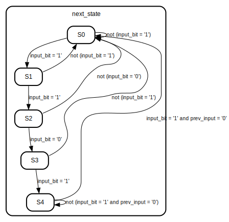

# Entity: sequence_detect 
- **File**: Sequence_1101.vhdl

## Diagram

## Ports

| Port name       | Direction | Type      | Description |
| --------------- | --------- | --------- | ----------- |
| clk             | in        | std_logic |             |
| reset           | in        | std_logic |             |
| input_bit       | in        | std_logic |             |
| output_detected | out       | std_logic |             |

## Signals

| Name          | Type       | Description |
| ------------- | ---------- | ----------- |
| current_state | state_type |             |
| next_state    | state_type |             |
| prev_input    | std_logic  |             |

## Types

| Name       | Type                                                                                                                                                                 | Description |
| ---------- | -------------------------------------------------------------------------------------------------------------------------------------------------------------------- | ----------- |
| state_type | (S0,  S1,  S2,  S3,  S4) |             |

## Processes
- unnamed: ( clk, reset )
- unnamed: ( current_state, input_bit )

## State machines

